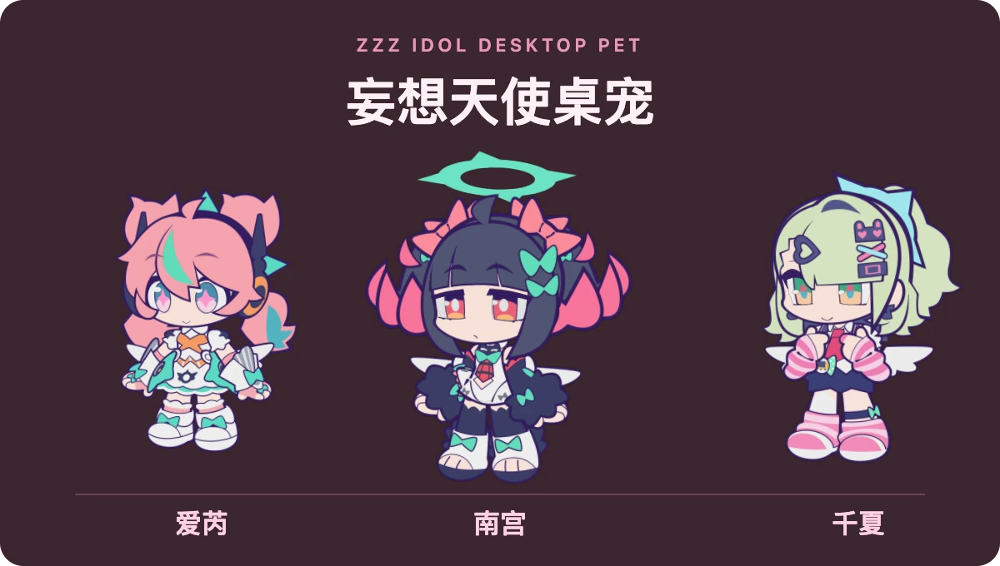
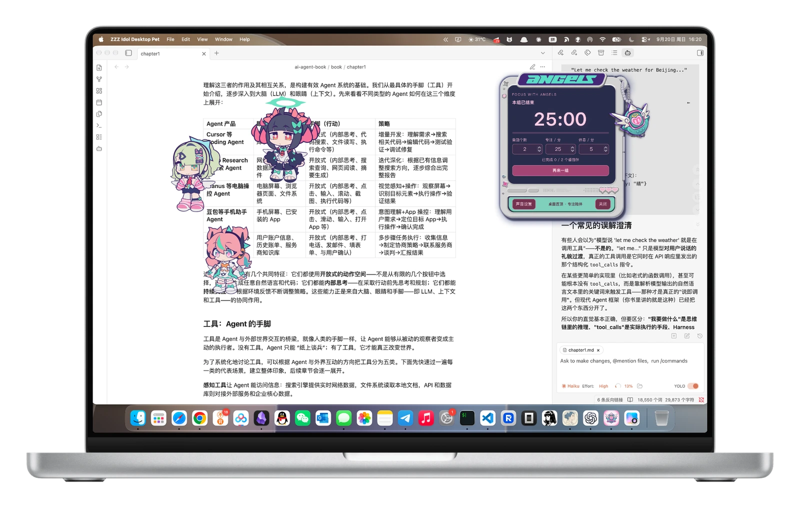
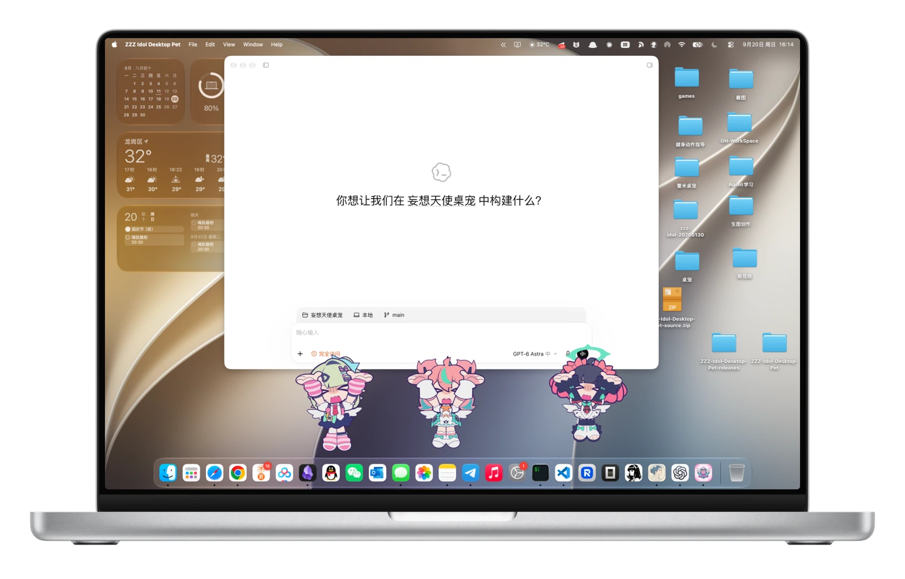

<div align="center">

# 妄想天使桌宠

**ZZZ Idol Desktop Pet**

让爱芮、南宫、千夏住进你的桌面，陪你互动、漫步与专注。

[下载安装](#下载安装) · [使用指南](#使用指南) · [反馈问题](https://github.com/HanaAyane/ZZZ-Idol-Desktop-Pet/issues)

</div>

<p align="center">
  
</p>

## 桌面上的三位伙伴

- **一起陪伴** — 三位角色可同时显示，分别调节大小，也能单独隐藏。
- **自然互动** — 点击、双击、拖拽都有反馈，视线跟随鼠标，支持集合与散开。
- **自由漫步** — 横向、斜向六个方向移动，频率和速度随你调整。
- **窗口托举** — 将角色拖到普通窗口底边，让她们贴边托举；也可开启漫步时自动托举。
- **专注陪伴** — 番茄钟与自定义计时两种模式，支持不等间隔提醒、暂停与继续，关闭窗口后仍在后台计时。

## 实际效果

<p align="center">
  <strong>专注陪伴 · 独立番茄钟</strong><br>
  <a href="assets/readme/pomodoro.webp"></a>
</p>

<p align="center">
  <strong>一起托举 · 三人贴边互动</strong><br>
  <a href="assets/readme/window-lift.webp"></a>
</p>

## 下载安装

macOS 最新版 **v0.1.1** 新增自定义计时与多时间点提醒。[查看更新说明](https://github.com/HanaAyane/ZZZ-Idol-Desktop-Pet/releases/tag/v0.1.1)。Windows v0.1.1 安装包将稍后补充，当前可下载 v0.1.0。

| 系统 | 下载 | 安装方式 |
| :--- | :--- | :--- |
| macOS · Apple Silicon（M 系列） | [下载 v0.1.1 DMG](https://github.com/HanaAyane/ZZZ-Idol-Desktop-Pet/releases/download/v0.1.1/ZZZ-Idol-Desktop-Pet_0.1.1_aarch64.dmg) | 打开后将应用拖入「应用程序」 |
| Windows · x64 | [下载 EXE](https://github.com/HanaAyane/ZZZ-Idol-Desktop-Pet/releases/download/v0.1.0-windows.1/ZZZ.Idol.Desktop.Pet_0.1.0_x64-setup.exe) | 运行安装向导；[MSI 可选](https://github.com/HanaAyane/ZZZ-Idol-Desktop-Pet/releases/tag/v0.1.0-windows.1) |

macOS 暂无 Intel 安装包，首次打开可能被系统拦截，请查看 [macOS 安装说明](https://github.com/HanaAyane/ZZZ-Idol-Desktop-Pet/releases/tag/v0.1.1)。

## 使用指南

1. **启动应用**，三位角色会出现在桌面上。拖动角色即可调整位置。
2. **右键角色或打开系统托盘菜单**，进入设置，调整显示、大小、置顶和互动选项。
3. **按喜好开启漫步与托举**；开启「手动窗口托举」后，将角色拖到普通窗口底边附近松手，拖离或按 `Esc` 可放下。
4. **打开番茄钟**，从设置或菜单进入。默认每组 2 轮，专注 25 分钟、休息 5 分钟，开始前可自行调整。
5. **需要按自己的节奏提醒时**，切换到「自定义计时」，设置总时长和多个提醒点。例如计时 120 分钟，在第 25、45、90 分钟分别提醒。

设置快捷键：macOS `⌘ ,` / Windows `Ctrl + ,`。番茄钟关闭窗口后继续计时；退出并重启应用后，进度恢复为暂停，点击继续即可。

遇到问题时，可在设置中导出诊断报告，并附上系统版本、复现步骤与截图提交 [Issue](https://github.com/HanaAyane/ZZZ-Idol-Desktop-Pet/issues)。

<details>
<summary><strong>开发与构建</strong></summary>

基于 Tauri 2、TypeScript、Rust 与 Spine Runtime。需要 Node.js 22、Rust stable 和目标平台的 Tauri 构建依赖；macOS 需要 Xcode Command Line Tools。

```bash
git clone https://github.com/HanaAyane/ZZZ-Idol-Desktop-Pet.git
cd ZZZ-Idol-Desktop-Pet/desktop-pet
npm ci
npm run tauri -- dev
```

校验与构建：

```bash
npm run validate:windows-prep
npm run build
cargo test --manifest-path src-tauri/Cargo.toml --locked --lib
```

macOS 应用打包：

```bash
npm run tauri -- build --bundles app -- --locked
```

产物位于 `desktop-pet/src-tauri/target/release/bundle/macos/`。Windows x64 的 NSIS / MSI 由 [GitHub Actions](https://github.com/HanaAyane/ZZZ-Idol-Desktop-Pet/actions/workflows/windows-build.yml) 构建。

[完整功能与开发说明](desktop-pet/README.md) · [Windows 实机验收清单](WINDOWS-TESTING.md)

</details>

## 版权与声明

本项目是非官方、非商业的个人同人衍生项目，与米哈游、HoYoverse、《绝区零》及相关官方活动不存在隶属、合作、赞助或背书关系。

爱芮、南宫、千夏的角色形象、动画及相关原始素材来源于《绝区零》相关官方活动，其知识产权归米哈游及其他相关权利人所有。本项目不主张拥有这些原始素材的版权；素材整理、动作适配和桌宠功能开发不改变原始素材的权利归属，也不代表获得官方授权。

本项目仅用于个人学习、非商业展示与技术研究。不得将含有上述素材的桌宠安装包、角色动画或宣传图出售、商业授权或打包销售，不得移除来源和版权说明，也不得用于暗示官方关联的用途。

本仓库不对第三方素材及其衍生内容授予通用再授权；Spine Runtime 等第三方运行库仍遵循各自的许可与使用条件。如权利人对仓库内容有异议，请通过 [Issue](https://github.com/HanaAyane/ZZZ-Idol-Desktop-Pet/issues) 提出移除或调整请求。
